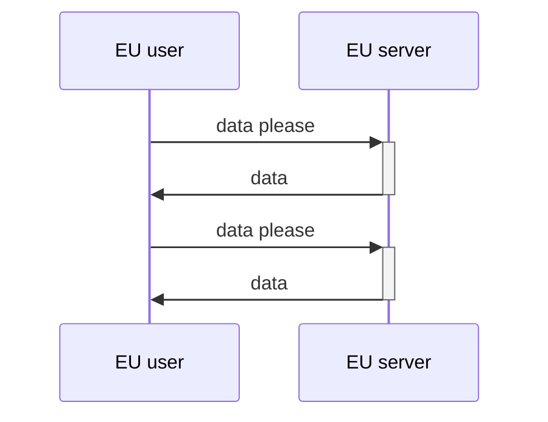
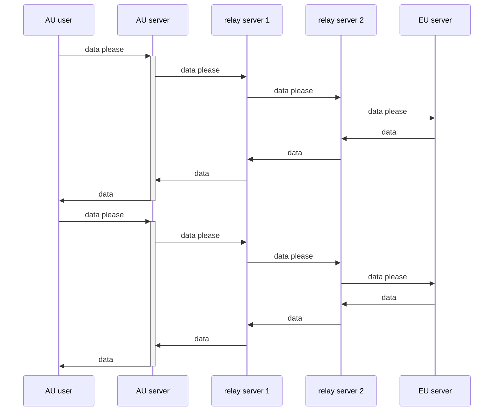
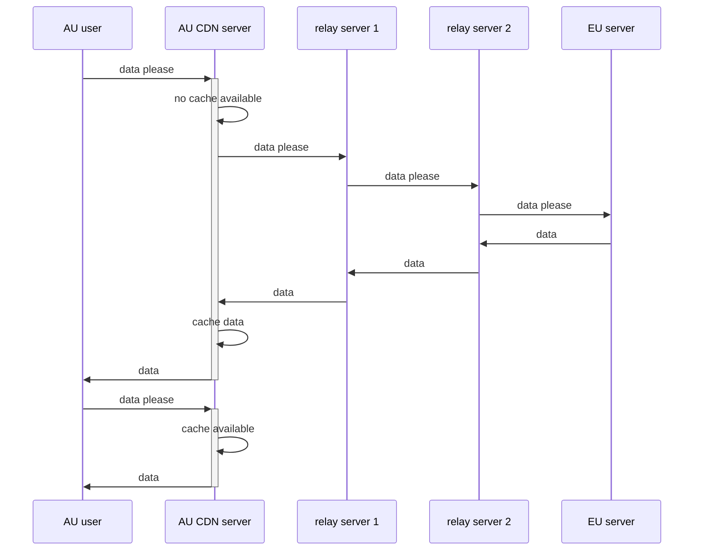

> internal notes: never mention need to maximize?
> 

siibra toolsuite facilitates the access of arbitarily large data by just-in-time requesting the relevant data at appropriate level of detail over the network. This approach has several advantages:

- it grants the end users the control and flexibility to define areas of interest and level of details
- it allows applications in any language to be bootstraped, so long as the runtime has network connection<doi:[10.1109/SAINTW.2003.1210138](https://doi.org/10.1109/SAINTW.2003.1210138)>. More specifically,
- it allows a web application to be boostraped - thereby greatly improves the accessibility of brain atlases

However, this approach also introduces a number of failure modes, namely:

- webserver performance under load
- webserver latency
- webserver reliability
- technology dependencies

all of which, may affect the end users’ perceived performance of siibra-toolsuite.

## Methodologies

### Collecting HTTP requests/Timing

The following section describes the method used to acquire a list of HTTP requessts of a simulated user performing a specific task.

The user launched a new instance of Chrome browser, typed the URL of the production version of siibra-explorer into the address bar. Once the web application loads, the user switched to Julich Brain parcellation in Big Brain template space; zoomed in on a cortical region (to `11.103mm, 16.826mm, 36.613mm`) ; waited until the loading of all details was complete. 

The task was carried out on a Chrome browser (Chrome Version 139.0.7258.66 (Official Build) (64-bit), and the HAR archive <https://docs.logdog.app/export/#har-format> of the HTTP requests were exported by the same browser using the bundled Chrome Dev Tool. The HAR archive was then transformed into HTTP requests in a new line delineated text file via the following command:

```bash
jq -r '.log.entries[].request.url' bigbrain.har > bigbrain.txt
```

To retrieve the timings of the HTTP requests can be retrieved in the same archive with the following command

```bash
jq '[.log.entries[] | { start: .startedDateTime, url: .request.url }]' bigbrain.har > bigbrain_timing.har
```

### Load/Latency tests pipeline

The following section describes the method load tests and latency tests are carried out. 

Ansible <https://docs.ansible.com/> playbooks were configured to:

- provision new “Nanode 1 GB” virtual machine(s) (1 CPU, 1GB RAM, 40 Gbps / 1 Gbps network in/out) on Linode <https://www.linode.com/> on specified geographical location(s). Specific parameters are as follows:
    - Load tests: 8 x `{eu-central}` nodes
    - Latency tests: 1 x `{eu-central,us-east,us-west,ap-southeast}` nodes
- clone the load testing repository<https://github.com/fzj-inm1-bda/siibra-infrastructure-profiling>, which includes the list of HTTP requests collected in the previous step, and setup the virtual environment
- in all provisioned nodes, start the test using Locust<https://locust.io/>, with specified duration (default: 60 seconds) and number of users (default: 1), and specified target (default: image data virtual machine)
- retrieve the output of the tests in csv and json format
- deprovision the virtual machines

### Metrics of interest

From the retrieved test outputs, the *Median Response Time*  value of the final entry - representing the aggregated metrics -  in `*_stats.csv` was extracted and used as a benchmark across all tests in this study. 

The timing of the requests were first calibrated so that the first HTTP request occur at t = 1ms, and then binned every 1000ms. 

## Results

In addition to the servers listed below, siibra-toolsuite also utilizes open-source infrastructures such as pypi and github to host source code, built binaries and configurations. As these servers fall outside of the authors’ control, their performances are not discussed.

The results can be found at <https://github.com/FZJ-INM1-BDA/iav-dep-test/tree/18e0571/locust_output/2025-08-08>

### Image data virtual machine

The image data virtual machine is a virtual private server with 1 vCPU, 4 GB RAM, provisioned by EBRAINS infrastructure, on physical hardwares located in Juelich Supercomputing Center, Germany. It serves mostly static data via nginx <https://nginx.org/>. 

|  | median response time (ms) |
| --- | --- |
| load test | 9 (1) |
| latency test eu-central | 10 |
| latency test us-east | 100 |
| latency test us-west | 160 |
| latency test ap-southeast | 400 |

*Table 1. Median response time (milliseconds) of the image data server under load/latency tests*

### siibra-explorer web application

siibra-explorer is deployed via a kubernetes installation maintained by EBRAINS infrastructure team. The service architecture is briefly discussed in S1. 

|  | median response time (ms) |
| --- | --- |
| load test | 191 (90) |
| latency test eu-central | 51 |
| latency test us-east | 100 |
| latency test us-west | 170 |
| latency test ap-southeast | 300 |

*Table 2. Median response time (milliseconds) of siibra-explorer server under load/latency tests*

### siibra-api REST wrapper for siibra-python

siibra-api is deployed via a kubernetes installation maintained by EBRAINS infrastructure team. The service architecture is briefly discussed in S2.

|  | median response time (ms) |
| --- | --- |
| load test | 50 (15) |
| latency test eu-central | 14 |
| latency test us-east | 110 |
| latency test us-west | 160 |
| latency test ap-southeast | 310 |

*Table 3. Median response time (milliseconds) of siibra-api server under load/latency tests*

## Discussions

### Characteristics of web servers

Siibra-toolsuite makes use of three groups of web servers: image data virtual machine(s), siibra-api web servers, and siibra-explorer web server(s). The distinction was designed to compartmentalize the service components according to their access patterns (Table 4.). This strategy allows the infrastructure, deployment strategies, and software components of each server group to be fine-tuned, in order to optimize the tradeoff between performance and maintainability.

|  | data-vm | siibra-api | siibra-explorer |
| --- | --- | --- | --- |
| number of requests | 1647 | 100 | 36 |
| average response size (kb) | **89** | 41 | 166 |
| update frequency (per year) | 2 | 6 | 20 |
| required storage (GB) | >500 | 10 | 2 |
| access pattern (see Figure 1) | high, constant | low, sporadic | low, front loaded |

*Table 4. Number of requests, average response size, update frequency of the servers*

TODO add figure

### Validity of testing parameters

While all attempts were made to simulate user(s) and measure their user experience as genuinely as possible, it should be noted that the simulated environment still differ to real users:

- While the HTTP requests were derived from a typical usecase, the access pattern tested in the load/latency test is modelled after the worst case scenario:
    - the simulated user send HTTP requests in series without pause; whereas the genuine usecase would involve periods of inactivity - where users process and interact with the web application
    - the simulated user always send previously seen HTTP requests, whereas modern browsers in typical usecases would aggressively cache HTTP responses using etag<https://httpwg.org/specs/rfc9110.html#field.etag>, cache-control<https://httpwg.org/specs/rfc9111.html#field.cache-control> headers.
- VPS used for the simulated user is connected to the network via a physical ethernet connection in a data center; whereas a real user may often be connected to the internet via WiFi, behind router(s) and internet service providers.

### Load performance test

As image data virtual machine is expected to consistently receive large quantities of traffic, the ability to maintain performance at high load is paramount. As a result, nginx, a highly performant webserver was configured and deployed on a virtual machine with reasonable amount of resource. Image data virtual machine (Table 1) did not demonstrate measurable degregation of performance at higher load.

Siibra-api, the REST wrapper for siibra-python, experienced performance degredation (median response time at 8 concurrent users: TODO) at a continuously elevated load (Table 3). The observed degredation should only have limited effect on user experience, as the access pattern to siibra-api web servers are sporadic and low in volume (Figure 1.). Nevertheless, additional measures will be implemented in the future to horizontally scale siibra-api web servers based on demand.

Siibra-explorer, the web application, experienced similar performance degregation (median response time at 8 concurrent users: TODO) at a continuously elevated load (Table 2). The thereotical performance degredation should only have limited effect on user experience, as the requests made to siibra-explorer server is front loaded and occurs at the beginning of the user session. 

### Latency performance test

All of the webservers are hosted on infrastructure located in Europe. This unsurprisingly results in increased latency for users situated in regions geographical distant to Europe (Table 1., 2., 3.). The increased latency materially affects the user experience. The viability content delivery network has been investigated to solve this issue.



*Figure 2. sequence diagram illustrating the round trip of a user situated in Europe requesting data*



*Figure 3. sequence diagram illustrating a user in Australia requesting data without CDN*



*Figure 4. sequence diagram illustrating a user in Australia requesting data with CDN*

|  | datavm (cold) | datavm (warm) | siibraapi (cold) | siibraapi (warm) | siibraexplorer (cold) | (warm) |
| --- | --- | --- | --- | --- | --- | --- |
| eu-central | 59 | 12 | 87 | 16 | 89 | 18 |
| us-east | 100 | 13 | 110 | 15 | 110 | 15 |
| us-west | 170 | 14 | 180 | 15 | 190 | 21 |
| ap-southeast | 270 | 18 | 280 | 22 | 280 | 23 |

### Reliability

Service reliability can be compromised by software bugs, scheduled maintenances, and unscheduled events, affecting siibra-toolsuite services, the underlyiing infrastructure, or services depended by siibra-toolsuite. A number of strategies were deployed in order to minimize the impact of these incidents.

All webservers administered by siibra-toolsuite team are monitored using a combination of log aggregation (by way of Fluentd<https://www.fluentd.org/> and Grafana Loki<https://grafana.com/oss/loki/>), and metrics scraping (by way of Prometheus<https://prometheus.io/>). The collected metrics is visualized in Grafana<https://grafana.com/grafana/> dashboards. 

Additionally, regularly scheduled end-to-end tests were setup on Github Actions <https://github.com/fzj-inm1-bda/iav-dep-test>. While lacking in coverage, the end-to-end test provide timely update on the health of critical services.

Service interruptions have been avoided during prolonged scheduled infrastructure maintenance. This was achieved by deploying a read-only clone of the production service on a backup infrastructure. The relative ease of deploying a duplicated service was a result of adopting industry standard practices of infrastructure as code, and developing in the open, where source code, configurations, are hosted on distributed systems.

## Appendix

S1. 

At the time of writing, siibra-explorer is deployed on a rancher <https://www.rancher.com/> installaction. A replica of two pods, each with `[0.1, 0.2]` vCPUs `[128, 256]` MB of RAM. The exact deployment details can be seen at <https://github.com/FZJ-INM1-BDA/siibra-explorer/blob/v2.14.22/.helm/siibra-explorer/values.yaml> 

S2.

At the time of writing, siibra-api is deployed on a rancher <https://www.rancher.com/> installation. The architecture diagram can be found at <https://github.com/FZJ-INM1-BDA/siibra-api/blob/v0.3.27/docs/architecture.throughput.md#architectural-diagram-1> While siibra-api is architectured to be capable of running as a standalone fastapi application, the deployment referred in this study uses a server/worker architecture, facilitated by celery.